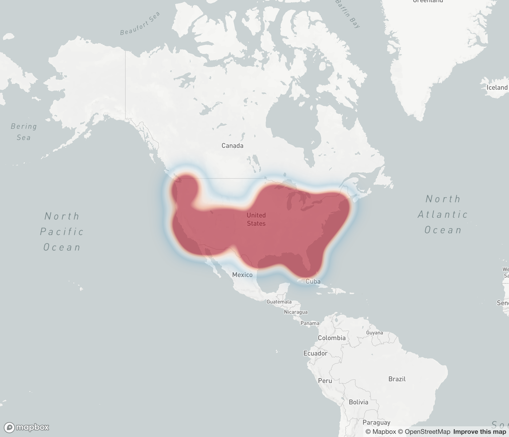

# Mapbox GL JS Boilerplate
This boilerplate helps setup a tiny mapbox frontend project that leverages TruFactor data to provide low-lift geospatial demographic queries.


## Setup
Getting started is very simple. Ensure you have the latest LTS of `node.js` & `npm` installed. Provided that's the case you can install the projects dependencies with a basic command from the project root directory.
```
npm i
```
After installing the dependencies, you can build the project and begin listening for code changes with
```
npm start
```
It will show a url you can visit to view the running boilerplate in the browser. It will automatically hot-reload changes when they're made.

## Technologies
* **Mapbox** An open source mapping platform for custom designed maps
* **TruFactor** An open source api library providing geospatial+demographic data
* **Parcel** Modern zero-configuration module bundler for JavaScript
* **Pug** Templating library to reduce redundancy of old-school XML tags you'd find in HTML
* **Stylus** CSS Preprocessor that allows interpolation, mixins, expressive sub-blocking & more
